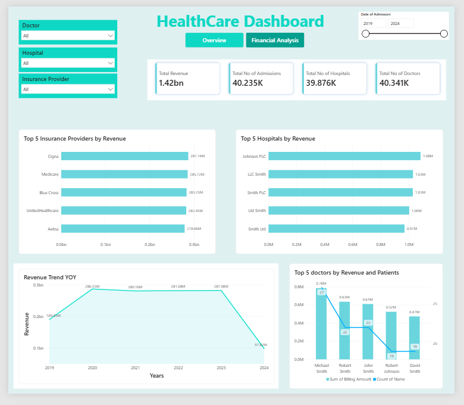
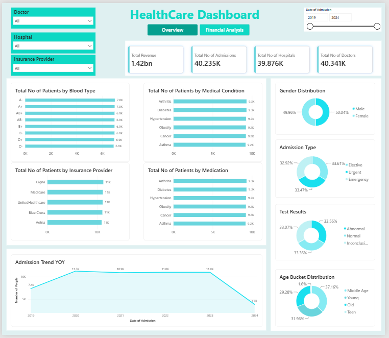

# 🏥 HealthCare Dashboard

An interactive **Power BI** dashboard built to analyze hospital admissions, revenue, patient demographics, and medical trends across insurance providers, hospitals, and doctors.

---

## 📊 Overview

This dashboard provides a 360° view of healthcare operations, covering both **financial performance** and **patient/clinical insights**. It's built with two main pages:

### 1️⃣ Financial Analysis
- **Total Revenue**, **Total Admissions**, **Total Hospitals**, and **Total Doctors** (KPI cards)
- **Top 5 Insurance Providers by Revenue**
- **Top 5 Hospitals by Revenue**
- **Revenue Trend (Year-over-Year)**
- **Top 5 Doctors by Revenue and Patient Count**

### 2️⃣ Overview
- **Total Patients by Blood Type**
- **Total Patients by Medical Condition**
- **Total Patients by Insurance Provider**
- **Total Patients by Medication**
- **Admission Trend (Year-over-Year)**
- **Gender Distribution**
- **Admission Type** (Elective / Urgent / Emergency)
- **Test Results** (Normal / Abnormal / Inconclusive)
- **Age Bucket Distribution** (Teen / Young / Middle Age / Old)

---

## 🎛️ Interactive Filters

Both pages include slicers to drill into the data:
- Doctor
- Hospital
- Insurance Provider
- Date of Admission (range slider, 2019–2024)

---

## 🖼️ Screenshots

| Financial Analysis | Overview |
|---|---|
|  |  |


---

## 🛠️ Tech Stack

- **Power BI Desktop** — data modeling, DAX measures, and report design
- **Power Query (M)** — data transformation and cleaning

---

## 📂 Dataset

The data used in this dashboard is sourced from **Kaggle**.

> Add the specific dataset name and link here, e.g.:
> [Healthcare_Dataset](https://www.kaggle.com/datasets/prasad22/healthcare-dataset)

---

## 📁 Repository Contents

```
├── HealthCare_Dashboard.pbix    # Power BI report file
├── README.md                    # Project documentation
└── screenshots/                 # Dashboard preview images
```

---

## 🚀 How to Use

1. Clone or download this repository.
2. Open `HealthCare_Dashboard.pbix` in **Power BI Desktop**.
3. Use the slicers (Doctor, Hospital, Insurance Provider, Date of Admission) to explore the data interactively.
4. Switch between the **Overview** and **Financial Analysis** tabs to view different insights.

---

## 📌 Notes

- Data used in this dashboard is sourced from a public Kaggle dataset.
- Revenue and patient figures reflect the source dataset and are not tied to real-world healthcare records.

---

## 📄 License

This project is open source and available for personal or educational use.
